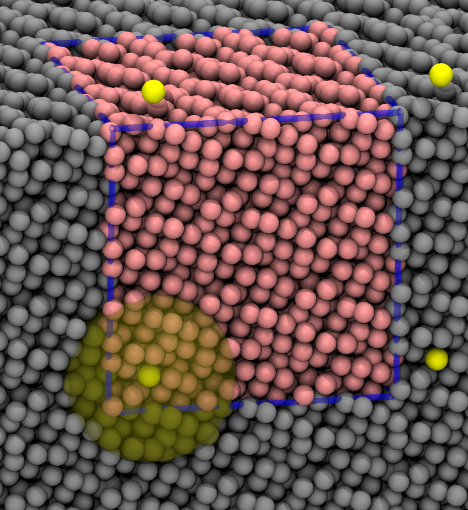

# LJMD Project

This package contains simplified MD code for simulating atoms
with a Lennard-Jones potential.


## Contents

The bundled makefiles are set up to compile the executable once
in serial and once with MPI with each build
placing the various object files in separate directories.

The examples directory contains 3 sets of example input decks
and the reference directory the corresponding outputs.



## Build instructions:
Compile everything:

```bash
make
```

Remove all compiled objects
```bash
make clean
```

## What does the program do?

1. Read in parameters, initial position and velocities of atoms and compute what is missing
2. Integrate equations of motion with velocity verlet for a given number of steps
   - Propagate all velocities for half a step
   - Propagate all positions for a full step
   - Compute forces on all atoms to get accelerations
   - Propagate all velocities for half a step
   - Output intermediate results if needed
  
## Instructions

1. Use OpenMP to parallelize the most time consuming operations in the serial program
2. Create a simple MPI parallelization by using replicated data (each MPI process has all information)
3. Document the changes in speedup and efficiency for each version of your code
